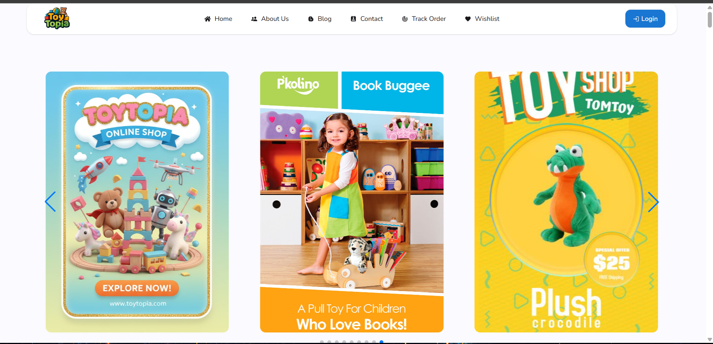

# 🧸 ToyTopia — A Kids Toy Shop

ToyTopia is a modern, user-friendly web application built for toy lovers and parents. It allows users to browse, explore, and shop for toys across various categories. The platform integrates user authentication, wishlist management, and smooth navigation to deliver a delightful shopping experience.

---

## 🌐 Live Demo

👉 **Live URL:**: https://toytopia-spa.web.app


---

## 🎯 Project Purpose

ToyTopia is designed to showcase a **full-stack React web application** using Firebase for authentication and data storage.  
The main objectives of this project are to:
- Provide a simple and attractive toy marketplace UI.
- Implement secure user authentication (Email/Password + Google login).
- Allow users to **add/remove toys to their wishlist**.
- Demonstrate responsive, reusable React components and routes.
- Use Firebase and environment variables for secure, scalable integration.

---

## ⚙️ Key Features

✅ **User Authentication**
- Login and Register with Email & Password.
- Google Sign-In using Firebase Authentication.
- Protected routes (accessible only for logged-in users).

✅ **Wishlist Management**
- Add or remove toys from wishlist.
- Wishlist data stored securely in Firestore.
- Heart icon toggles instantly on click.

✅ **Dynamic Toy Catalog**
- Browse toys by categories and subcategories.
- See detailed product descriptions.
- "Read More" navigation to toy details page.

✅ **Responsive Design**
- Built with **Tailwind CSS** and **DaisyUI**.
- Fully mobile-friendly, tablet, and desktop optimized.

✅ **Smooth Navigation**
- Implemented with **React Router** for SPA (Single Page Application).
- Persistent navigation bar with dropdown on mobile.

✅ **Notifications & UX Enhancements**
- Toast messages for every action using **React Toastify**.
- Dynamic page titles with **React Helmet Async**.
- Scrolling text banners using **React Fast Marquee**.


✅ **Valid Links**
- Only the **Home** and **Wishlist** are validate for navlink
- rest of the links are dummy in navbar

---

## 🧩 Tech Stack & NPM Packages Used

| Category | Packages / Tools |
|-----------|------------------|
| **Frontend** | React, React Router DOM |
| **UI Frameworks** | Tailwind CSS, DaisyUI, Vanilla CSS |
| **Icons & Effects** | React Icons, React Fast Marquee |
| **Authentication & Database** | Firebase (Email/Pass + Google Auth) |
| **Context & State Management** | React Context API (AuthProvider) |
| **Alerts & Feedback** | React Toastify |
| **Head Management** | React Helmet Async |
| **Environment Handling** | Vite + `.env` variables |
| **Slider / Carousel** | React Slider or Swiper (if used in banner) |

---

## 🛠️ Environment Variables Setup

Before running the project, create a `.env.local` file in your project root and add the following:

```bash
VITE_apiKey=api_key
VITE_authDomain=_auth_domain_
VITE_projectId=_project_id_
VITE_storageBucket=_storage_bucket_
VITE_messagingSenderId=_sender_id_
VITE_appId=_app_id_


🚀 How to Run Locally

1.Clone this repository:

git clone https://github.com/yourusername/toytopia.git
cd toytopia


2.Install dependencies:

npm install


3.Add your Firebase config to .env file.

4.Run the app:

npm run dev


5.Visit your local app:

http://localhost:5173


6.live preview:



📜 License

This project is open-source and available under the MIT License.


💬 Feedback

If you liked this project, give it a ⭐ on GitHub and share your feedback!
Happy Coding 🎈
